# API de Gestão de Tarefas - Documentação

## 1. Visão Geral

Esta API foi desenvolvida para auxiliar no gerenciamento de tarefas colaborativas, permitindo que usuários criem, editem, atribuam e concluam tarefas – contando com autenticação baseada em JWT para controle de acesso.

Cada usuário pode:

• Criar novos usuários

• Obter informações de um usuário específico

• Atualizar informações de usuários

• Remover usuários

• Criar tarefas novas

• Obter detalhes de uma tarefa

• Listar todas as tarefas atribuídas a um usuário

• Atualizar informações de uma tarefa

• Remover uma tarefa

## 2. Decisões Arquiteturais

### 2.1 Escolha da Arquitetura: Arquitetura em Camadas (Layered Architecture)

A aplicação foi desenvolvida utilizando a Arquitetura em Três Camadas, com o objetivo de promover:

• Separação de responsabilidades entre as camadas (apresentação, aplicação/negócio e persistência).

• Facilidade de manutenção e testes (isolamento das camadas).

• Escalabilidade futura, permitindo a evolução independente de cada camada.

#### 2.1.1 Camada de Apresentação (Controller)

Responsável por expor a API RESTful ao cliente. As principais classes estão localizadas em:

src\main\java\com\quimera\taskmanager\dominio\usuario\controller\UsuarioController.java 
src\main\java\com\quimera\taskmanager\dominio\tarefa\controller\TarefaController.java

src\main\java\com\quimera\taskmanager\configuracao\GlobalExceptionHandler.java

#### 2.1.2 Camada de Aplicação/Negócio (Service)

Contém a lógica de negócios da aplicação. As principais classes estão localizadas em:

src\main\java\com\quimera\taskmanager\dominio\usuario\service\UsuarioService.java src\main\java\com\quimera\taskmanager\dominio\tarefa\service\TarefaService.java 

src\main\java\com\quimera\taskmanager\dominio\usuario\dto
src\main\java\com\quimera\taskmanager\dominio\tarefa\dto

src\main\java\com\quimera\taskmanager\dominio\usuario\mapper\UsuarioMapper.java
src\main\java\com\quimera\taskmanager\dominio\tarefa\mapper\TarefaMapper.java

#### 2.1.3 Camada de Persistência (Repository)

Utiliza Spring Data JPA para abstração de operações com o banco de dados. As principais classes estão localizadas em:

src\main\java\com\quimera\taskmanager\dominio\usuario\repository\UsuarioRepository.java
src\main\java\com\quimera\taskmanager\dominio\tarefa\repository\TarefaRepository.java

Representa os modelos persistentes que refletem o banco de dados. As principais classes estão localizadas em:

src\main\java\com\quimera\taskmanager\dominio\usuario\domain\Usuario.java src\main\java\com\quimera\taskmanager\dominio\tarefa\domain\Tarefa.java

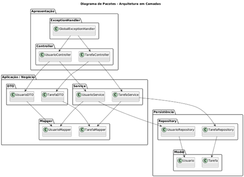
 
## 3. Padrões Aplicados

A aplicação foi desenvolvida seguindo alguns padrões de projeto e boas práticas, dentre eles:

### 3.1 DTO (Data Transfer Object)

O DTO é utilizado para encapsular e expor apenas os dados necessários nas requisições e respostas, evitando assim exposição direta das entidades.

### 3.2 Mapper

O Mapper é utilizado para promover a conversão entre entidades e DTOs, facilitando a reutilização e manutenção.

### 3.3 Controller-Service-Repository 

A divisão de Controller-Service-Repository é utilizado para manter uma arquitetura desacoplada, clara e testável.

### 3.4 Global Exception Handler 

O Global Exception Handler é utilizado para centralizar o tratamento de erros da API, garantindo respostas padronizadas. 

## 3. Modelagem de Dados: Diagrama do banco de dados e descrição das tabelas/coleções. 

### 3.1 Conceitual 

 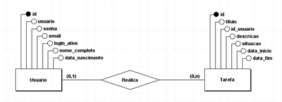
 
### 3.2 Lógico

 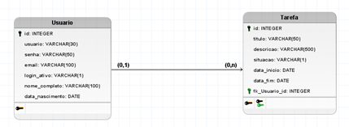

### 3.3 Descrição das tabelas

#### 3.3.1 Tabela: usuário

Armazena os dados dos usuários do sistema.
| Campo           | Tipo           | Descrição                                       |
|-----------------|----------------|-------------------------------------------------|
| id              | INTEGER (PK)   | Identificador único do usuário                  |
| usuário         | VARCHAR(30)    | Nome de login do usuário                        |
| senha           | VARCHAR(50)    | Senha criptografada do usuário                  |
| email           | VARCHAR(100)   | E-mail do usuário                               |
| login_ativo     | VARCHAR(1)     | Flag indicando se o login está ativo (S/N)      |
| nome_completo   | VARCHAR(100)   | Nome completo do usuário                        |
| data_nascimento | DATE           | Data de nascimento do usuário                   |

#### 3.3.2 Tabela: tarefa

Armazena as tarefas criadas por usuários.

| Campo         | Tipo           | Descrição                                     |
|---------------|----------------|-----------------------------------------------|
| id            | INTEGER (PK)   | Identificador único da tarefa                 |
| titulo        | VARCHAR(50)    | Título curto da tarefa                        |
| descricao     | VARCHAR(500)   | Descrição detalhada da tarefa                 |
| situacao      | VARCHAR(1)     | Situação atual                                |
| data_inicio   | DATE           | Data de início                                |
| data_fim      | DATE           | Data de término                               |
| fk_usuario_id | INTEGER (FK)   | Referência ao usuário criador da tarefa       |

## 4. Fluxo de Requisições 

### 4.1 Usuários

#### 4.1.1 POST /users 

Endpoint para criar um novo usuário.

 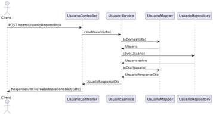
 
#### 4.1.2 GET /users/{id} 

Endpoint para obter informações de um usuário específico. 

 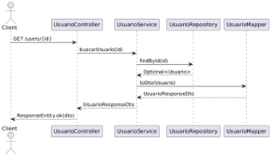
 
#### 4.1.3 PUT /users/{id} 

Endpoint para atualizar informações do usuário. 

 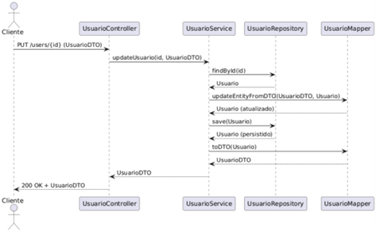

 
#### 4.1.4 DELETE /users/{id} 

Endpoint para remover um usuário. 

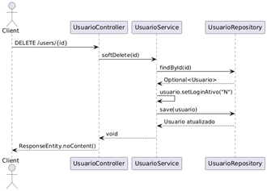

### 4.2 Tarefas

#### 4.2.1 POST /tasks 

Endpoint para criar uma nova tarefa. 

 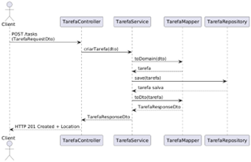
 
#### 4.2.2 GET /tasks/{id} 
Endpoint para obter detalhes de uma tarefa. 

 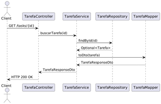
 
#### 4.2.3 GET /tasks?assignedTo={userId}
Endpoint para listar todas as tarefas atribuídas a um usuário. 

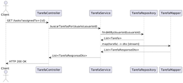
 
#### 4.2.4 PUT /tasks/{id} 
Endpoint para atualizar informações da tarefa (título, descrição, status). 
 
 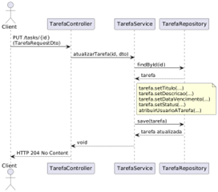

#### 4.2.5 DELETE /tasks/{id} 

Endpoint para remover uma tarefa.

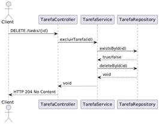

 
### 4.3 Autenticação

#### 4.3.1 POST /auth/login 

Endpoint para login de usuários, retornando um token para autenticação nas demais requisições.

#### 4.3.2 POST /auth/logout 
Endpoint para logout de usuários.

## 5. Configuração e Deploy

Execute: 
- git clone https://github.com/patricia-nagel/gerenciador-de-tarefas.git
- docker run -p 5431:5432 -v D:\Faculdade\PostgresData:/var/lib/postgresql/data -e POSTGRES_PASSWORD=1234 -d postgres

## 6. Testes Automatizados

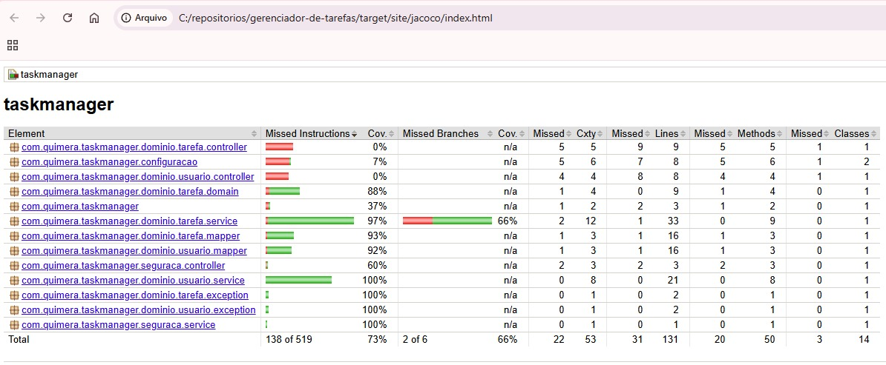